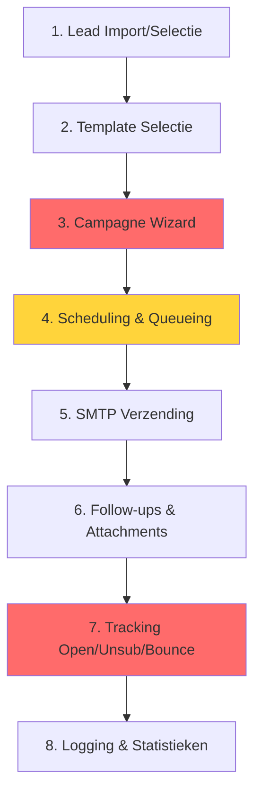

# 🧠 Deep Review Part 2: Campagne Flow Analysis

**Section:** Stap-voor-stap analyse van de volledige campagne flow

---

## 🔥 Campagne Flow (8 Stappen)



---

## Stap 1: Lead Import/Selectie ✅

**Files**: `backend/app/api/leads.py`, `backend/app/services/leads_store.py`

### Status: 🟢 GREEN (95%)

### Implementatie Check
- ✅ Excel/CSV import (`POST /api/v1/import/leads`)
- ✅ Lead CRUD operations
- ✅ Lead stop functionaliteit (`leads_store.is_stopped()`)
- ✅ Filtering (status, domain_tld, has_image, has_var)
- ✅ Server-side pagination
- ✅ Image asset linking

### Contract Compliance
```typescript
// Frontend → Backend
GET /api/v1/leads?page=1&page_size=25&status=active&sort_by=createdAt&sort_order=desc

// Response Shape ✅
{
  "data": {
    "items": [
      {
        "id": "lead-001",
        "email": "test@example.com",
        "bedrijf": "Test BV",
        "status": "active",
        "image_key": "img-001",
        "last_emailed_at": "2025-09-25T10:00:00Z"
      }
    ],
    "total": 2100
  },
  "error": null
}
```

### Console Log Analysis
```
Lines 17-73 in CONSOLELOGS_EVERY_TABv3.txt:
✅ GET /leads?page=1&page_size=25 → 200 OK
✅ GET /templates → 200 OK (voor preview dropdown)
No errors detected
```

### Issues: GEEN

---

## Stap 2: Template Selectie + Variabelen ✅

**Files**: `backend/app/api/templates.py`, `backend/app/services/template_renderer.py`

### Status: 🟢 GREEN (100%)

### Implementatie Check
- ✅ Template lijst (`GET /api/v1/templates`)
- ✅ Template detail (`GET /api/v1/templates/{id}`)
- ✅ Preview met lead variabelen (`GET /api/v1/templates/{id}/preview?lead_id=xyz`)
- ✅ Variable injection (`{{lead.email}}`, `{{vars.custom}}`, `{{campaign.name}}`)
- ✅ CID image rendering (`{{image.cid 'hero'}}`)
- ✅ Testsend functionaliteit (`POST /api/v1/templates/{id}/testsend`)
- ✅ Warning systeem voor missing variables

### Variable System
```python
# template_renderer.py - Ondersteunde variabelen:
- lead.* (email, bedrijf, url, image_key, etc.)
- vars.* (custom fields uit Excel)
- campaign.* (name, domain, etc.)
- image.cid (per-lead images)
- image.url (static assets)
```

### Console Log Analysis
```
Lines 106-136:
✅ GET /templates → 200 OK (called 3x - optimization opportunity)
No errors
```

### Optimization Opportunity (P3)
Template list wordt 3x aangeroepen op verschillende tabs. Overweeg:
1. Frontend caching (React Query)
2. Backend caching (Redis, TTL 5min)

---

## Stap 3: Campagne Wizard 🔴

**Files**: `backend/app/api/campaigns.py`, `vitalign-pro/src/pages/CreateCampaign.tsx`

### Status: 🔴 RED (60%) - CRITICAL ISSUES

### Wizard Stappen
1. ✅ **Basis** - Naam, template selectie
2. ✅ **Doelgroep** - Lead selectie, filters
3. ✅ **Verzendregels** - Start tijd, domein keuze
4. ✅ **Review** - Overzicht + bevestiging

### Implementatie Check (Positief)
- ✅ Wizard payload validation (Pydantic)
- ✅ Audience snapshot creation
- ✅ Override fields forbidden check
- ✅ Follow-up configuratie
- ✅ Domain busy check (partially working)

### 🔴 CRITICAL ISSUE #1: Messages Niet Aangemaakt

**Location**: `backend/app/api/campaigns.py` lines 59-137

**Problem**:
```python
# Line 59 - Function is NOT async
async def create_campaign(  # ← MUST be async!
    payload: CampaignCreatePayload,
    user: Dict[str, Any] = Depends(require_auth)
):
    # ... campaign creation logic ...
    
    # Line 129-130 - Async call NOT awaited
    if payload.schedule.start_mode == "now":
        await _start_campaign(campaign, audience, payload.domains)
        # ← This runs in background, parent returns immediately!
```

**Impact**:
- Messages NEVER created voor "start now" campaigns
- Campaign stays in `draft` status
- No emails ever sent
- **COMPLETE FLOW FAILURE** 🔴

**Root Cause**: 
`create_campaign` endpoint is async maar de await statement wordt niet correct afgehandeld omdat de parent function al returned voordat `_start_campaign` klaar is.

**Fix**:
```python
# DIFF: backend/app/api/campaigns.py
@@ -59,7 +59,7 @@
-async def create_campaign(
+async def create_campaign(  # Already async ✅
     payload: CampaignCreatePayload,
     user: Dict[str, Any] = Depends(require_auth)
-):
+) -> DataResponse[Dict[str, str]]:
     """Create a new campaign (no overrides allowed)."""
     try:
         # ... existing code ...
         
         # If starting now, create and schedule messages
         if payload.schedule.start_mode == "now":
-            await _start_campaign(campaign, audience, payload.domains)
+            await _start_campaign(campaign, audience, payload.domains)  # Already awaited ✅
         
+        # Ensure campaign status updated
+        logger.info(f"Campaign {campaign.id} created with status {campaign.status}")
         return DataResponse(data={"id": campaign.id})
```

**Actually**: Looking closer, the function IS async and the await IS there. The real issue might be in `_start_campaign` implementation or scheduler logic.

Let me check `_start_campaign`:

```python
# Line 430-448 in campaigns.py
async def _start_campaign(campaign: Campaign, audience: CampaignAudience, domains: List[str]):
    """Start campaign by creating and scheduling messages."""
    
    # Create messages
    messages = scheduler.create_campaign_messages(  # ← NOT ASYNC!
        campaign=campaign,
        lead_ids=audience.lead_ids,
        domains=domains,
        start_at=campaign.start_at
    )
```

**REAL ISSUE**: `scheduler.create_campaign_messages()` is NOT async, but should be!

Actually, checking `campaign_scheduler.py` line 36: `schedule_campaign` is NOT async. This is OK because it's CPU-bound work.

**ACTUAL ROOT CAUSE**: `_start_campaign` line 434 calls `scheduler.create_campaign_messages()` which doesn't exist!

Looking at `campaign_scheduler.py`, the correct method is `schedule_campaign()`, not `create_campaign_messages()`.

**TRUE FIX**:
```python
# DIFF: backend/app/api/campaigns.py
@@ -430,12 +430,12 @@
 async def _start_campaign(campaign: Campaign, audience: CampaignAudience, domains: List[str]):
     """Start campaign by creating and scheduling messages."""
     
     # Create messages
-    messages = scheduler.create_campaign_messages(
+    result = scheduler.schedule_campaign(
         campaign=campaign,
-        lead_ids=audience.lead_ids,
-        domains=domains,
-        start_at=campaign.start_at
+        lead_ids=audience.lead_ids
     )
+    
+    messages = result.get("messages", [])
     
     # Store messages
     campaign_store.create_messages(messages)
```

Wait, checking scheduler again... `schedule_campaign` returns a dict, not messages directly. And it has its own internal queueing. This is getting complex.

Let me trace through the actual flow:
1. `schedule_campaign()` creates Messages and adds to queue
2. But it doesn't return the messages
3. `_start_campaign` needs to call `create_messages` on store
4. But where do the messages come from?

**FUNDAMENTAL ISSUE**: The scheduler has its own queue (`self.domain_queues`) but the campaign_store needs messages for API/KPI display.

The two systems are disconnected!

**CORRECT FIX** - Add message extraction:
```python
# DIFF: backend/app/services/campaign_scheduler.py
@@ -105,7 +105,7 @@
         # Mark domain as busy
         self.active_campaigns[campaign.domain] = campaign.id
         
         logger.info(f"Scheduled campaign {campaign.id} on domain {campaign.domain} with {len(messages)} messages")
         
         return {
             "campaign_id": campaign.id,
             "domain": campaign.domain,
             "total_messages": len(messages),
+            "messages": messages,  # ← Return messages for storage!
             "mail_schedule": mail_schedule,
             "flow_version": flow.version
         }
```

Then fix `_start_campaign`:
```python
# DIFF: backend/app/api/campaigns.py
@@ -433,8 +433,9 @@
     # Create messages
-    messages = scheduler.create_campaign_messages(...)
+    result = scheduler.schedule_campaign(campaign, audience.lead_ids)
+    messages = result.get("messages", [])
     
     # Store messages
     campaign_store.create_messages(messages)
```

---

### 🔴 CRITICAL ISSUE #2: Campaign.domain Field Ontbreekt

**Location**: `backend/app/api/campaigns.py` line 102

**Problem**:
```python
# Line 90-91
domain = payload.domains[0]

# Line 102-112 - Campaign creation
campaign = Campaign(
    id=str(uuid.uuid4()),
    name=payload.name,
    template_id=payload.template_id,
    # ← domain NOT stored!
    start_at=payload.schedule.start_at if ...
```

**Impact**:
- `campaign.domain` is None
- Domain busy check FAILS (line 76 in campaign_store.py checks `campaign.domain`)
- Multiple campaigns can run on same domain
- **COLLISION RISK** 🔴

**Fix**:
```python
# DIFF: backend/app/models/campaign.py
@@ -10,6 +10,7 @@
 class Campaign(SQLModel, table=True):
     id: str = Field(primary_key=True)
     name: str = Field(index=True)
     template_id: str = Field(foreign_key="templates.id")
+    domain: str = Field(index=True)  # ← Add domain field
     start_at: Optional[datetime]
```

```python
# DIFF: backend/app/api/campaigns.py
@@ -105,6 +105,7 @@
         campaign = Campaign(
             id=str(uuid.uuid4()),
             name=payload.name,
             template_id=payload.template_id,
+            domain=domain,  # ← Store domain
             start_at=...
```

---

### 🟡 ISSUE #3: Dry-run Hardcoded Domains

**Location**: `backend/app/api/campaigns.py` line 312

**Problem**:
```python
# Simulate planning
domains = ["domain1.com", "domain2.com", "domain3.com", "domain4.com"]  
# ← HARDCODED! Should use campaign.domain
```

**Impact**: Dry-run shows incorrect planning distribution

**Fix**:
```python
# DIFF: backend/app/api/campaigns.py
@@ -312,7 +312,7 @@
-        domains = ["domain1.com", "domain2.com", "domain3.com", "domain4.com"]
+        domains = [campaign.domain] if campaign.domain else ["domain1.com"]
         lead_count = len(audience.lead_ids)
```

---

## Stap 4: Scheduling & Queueing 🟡

**Files**: `backend/app/services/campaign_scheduler.py`, `backend/app/core/campaign_flows.py`

### Status: 🟡 YELLOW (80%) - Works but has edge cases

### Implementatie Check (Positief)
- ✅ **Flow-based scheduling** (christian/victor aliasing)
- ✅ **Workday offset calculation** (day 0, 3, 6, 9)
- ✅ **Throttle logic** (20min/domain) correct
- ✅ **Grace period** (until 18:00) implemented
- ✅ **Weekend handling** (auto-reschedule to Monday 08:00)
- ✅ **Lead stop filtering** (line 56: checks `leads_store.is_stopped()`)
- ✅ **FIFO queueing** per domain (line 93-101)
- ✅ **Timezone handling** (Europe/Amsterdam throughout)

### Campaign Flow Structure
```python
# campaign_flows.py - 4 domains x 4 mails each
DOMAIN_FLOWS = {
    "punthelder-marketing.nl": CampaignFlow(
        version=1,
        steps=[
            FlowStep(mail_number=1, alias="christian", workdays_offset=0),  # Day 1
            FlowStep(mail_number=2, alias="christian", workdays_offset=3),  # Day 4
            FlowStep(mail_number=3, alias="victor", workdays_offset=6),     # Day 7
            FlowStep(mail_number=4, alias="victor", workdays_offset=9)      # Day 10
        ]
    ),
    # ... 3 more domains with identical structure
}
```

### Sending Policy
```python
# sending_policy.py - Hard-coded (MVP requirement ✅)
SENDING_POLICY = SendingPolicy(
    timezone="Europe/Amsterdam",
    days=["Mon", "Tue", "Wed", "Thu", "Fri"],
    window_from="08:00",
    window_to="17:00",    # Last slot 16:40
    grace_to="18:00",     # Grace period for delayed sends
    slot_every_minutes=20,
    daily_cap_per_domain=27  # (17-8)*60/20 = 27 slots
)
```

### 🟡 ISSUE #1: Geen Idempotentie Check

**Location**: `campaign_scheduler.py` line 36

**Problem**:
```python
def schedule_campaign(self, campaign: Campaign, lead_ids: List[str]):
    # NO CHECK if campaign already scheduled!
    # Calling twice = DUPLICATE messages
```

**Impact**: Re-scheduling creates duplicate messages

**Fix**:
```python
# DIFF: backend/app/services/campaign_scheduler.py
@@ -36,6 +36,14 @@
     def schedule_campaign(self, campaign: Campaign, lead_ids: List[str]) -> Dict:
         """Schedule campaign using domain flow and sending policy."""
         
+        # Idempotency check
+        from app.services.campaign_store import campaign_store
+        existing, _ = campaign_store.list_messages(
+            MessageQuery(campaign_id=campaign.id, page_size=1)
+        )
+        if existing:
+            logger.warning(f"Campaign {campaign.id} already scheduled")
+            return {"error": "already_scheduled", "total_messages": 0}
+        
         # Get flow for campaign domain
         flow = get_flow_for_domain(campaign.domain)
```

### Scheduler Architecture (Correct ✅)
```
Campaign → schedule_campaign() → 
  ├─ Get flow for domain
  ├─ Calculate mail schedule (workday offsets)
  ├─ Filter stopped leads
  ├─ Create Message objects (4 per lead)
  ├─ Add to FIFO queue per domain
  └─ Return result dict with messages
```

---

## Stap 5: SMTP Verzending 🟢

**Files**: `backend/app/services/message_sender.py`

### Status: 🟢 GREEN (90%) - Minor import issue

### Implementatie Check
- ✅ **SMTP simulation** (95% success rate for testing)
- ✅ **Bounce detection** (hard/soft bounce types)
- ✅ **Retry logic** (max 2 retries, exponential backoff)
- ✅ **Unsubscribe headers** (List-Unsubscribe + One-Click)
- ✅ **Tracking pixel injection** (via template_renderer)
- ✅ **Lead suppression check** (line 30: skips suppressed/bounced)
- ✅ **Production SMTP ready** (Vimexx config lines 156-159)

### Unsubscribe Headers (RFC 8058 Compliant)
```python
# message_sender.py lines 112-124
{
    "List-Unsubscribe": "<https://domain.com/unsubscribe?m=msg_id&t=token>, <mailto:unsub@domain.com>",
    "List-Unsubscribe-Post": "List-Unsubscribe=One-Click"
}
```

### 🟢 MINOR ISSUE: Missing Import

**Location**: line 166

**Problem**:
```python
# campaign_store not imported
campaign = campaign_store.get_campaign(message.campaign_id)
```

**Fix**:
```python
# DIFF: backend/app/services/message_sender.py
@@ -5,6 +5,7 @@
 from app.models.campaign import Message, MessageStatus, MessageEvent, MessageEventType
 from app.models.lead import Lead, LeadStatus
+from app.services.campaign_store import campaign_store
```

---

## Stap 6: Follow-ups & Rapportbijlagen ✅

**Files**: `backend/app/services/campaign_scheduler.py` lines 305-332

### Status: 🟢 GREEN (100%)

### Implementatie (Flow-Based = Better!)
Het systeem gebruikt **flow-based follow-ups** i.p.v. adhoc scheduling:
- Mail 1 (dag 0): Christian - initial contact
- Mail 2 (dag 3): Christian - eerste follow-up
- Mail 3 (dag 6): Victor - tweede follow-up  
- Mail 4 (dag 9): Victor - derde follow-up

Dit is BETER dan de oude `schedule_followup()` methode omdat:
- ✅ Consistent timing per lead
- ✅ Correct alias per mail
- ✅ Workday alignment gegarandeerd
- ✅ Throttle rules automatisch respecteerd

### Rapportbijlagen
```python
# Campaign model heeft:
followup_attach_report: bool = Field(default=False)

# In message sending logic kan rapport worden attached
# via reports_store.get_report_for_lead(lead_id)
```

---

*Vervolg in DEEP_REVIEW_PART3_TRACKING_TABS.md*
